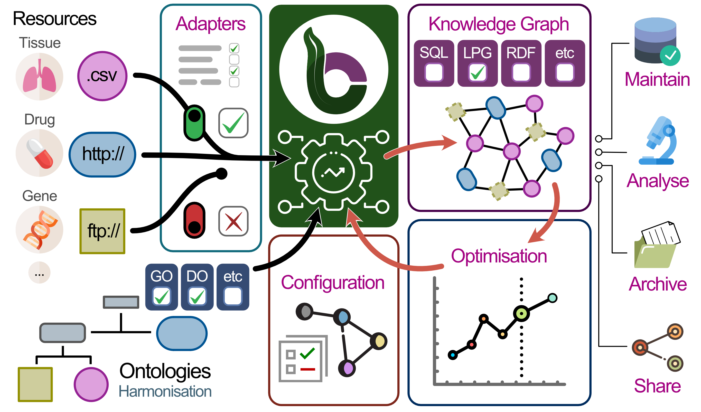

# Internship_VIB_2024_GitteDecat

In this github repository you can find all the scripts that are made during my traineeship by VIB at Zwijnaarde.

## Goal:

The purpose of my traineeship is to create an adapter file for the IRefIndex database to be able to create a knowledge graph using biocypher. 


## IRefIndex database
IREfIndex database is one of the biggest databases for protein-protein interactions available today. The primary goal of iRefIndex is to bring data together from multiple primary sources, such as BioGRID, IntAct, and MINT, into a single, unified format. This integration makes sure that we have access to the most complete and accurate information possible.

## Biocypher: 

BioCypher is the simplest way to create an AI-enabled knowledge graph for biomedical (or other) tasks. Knowledge graphs (KGs) are an approach to knowledge representation that uses graph structure to analysis of complex data.

Website: https://biocypher.org/contents.html 

## Neo4j: 

Neo4j is a leading graph database platform designed to manage and analyze data through a graph-based approach. Unlike traditional relational databases that use tables to store data, Neo4j uses nodes, relationships, and properties to create a graph structure. This allows for the efficient handling of complex, interconnected data, making it ideal for applications like social networks, fraud detection, and recommendation systems.

## Installation of biocypher:

Before you can run the script to create a knowledge graph, you have to create a poetry environment. If poetry is not installed, you can use pipx to install. 

### Install pipx
#### On macOS:
```bash
brew install pipx
pipx ensurepath
sudo pipx ensurepath --global # optional to allow pipx actions in global scope. See "Global installation" section below.
```

#### On Linux:
```bash
Ubuntu 23.04 or above
sudo apt update
sudo apt install pipx
pipx ensurepath
sudo pipx ensurepath --global # optional to allow pipx actions in global scope. See "Global installation" section below.
```

#### Fedora:
```bash
sudo dnf install pipx
pipx ensurepath
sudo pipx ensurepath --global # optional to allow pipx actions in global scope. See "Global installation" section below.
```

#### Using pip on other distributions:
```bash
python3 -m pip install --user pipx
python3 -m pipx ensurepath
sudo pipx ensurepath --global # optional to allow pipx actions in global scope. See "Global installation" section below.
```

#### On Windows:
```bash
scoop install pipx
pipx ensurepath
Install via pip (requires pip 19.0 or later)
```
If you installed python using Microsoft Store, replace `py` with `python3` in the next line.
```bash
py -m pip install --user pipx
```
It is possible (even most likely) the above finishes with a WARNING looking similar to this:
```bash
WARNING: The script pipx.exe is installed in `<USER folder>\AppData\Roaming\Python\Python3x\Scripts` which is not on PATH
```
If so, go to the mentioned folder, allowing you to run the pipx executable directly. Enter the following line (even if you did not get the warning):
```bash
.\pipx.exe ensurepath

```

### Install poetry: 
```bash
pipx install poetry
```

### Clone the github repository:
```bash
git clone git@github.com:GitteDecatBIT/Internship_VIB_2024_GitteDecat.git
cd Internship_VIB_2024_GitteDecat
```

### Install BioCypher as a dependency: 

```bash
poerty add biocypher 
```

### Install the dependencies using Poetry: 
```
poetry install 
```

### Activate environment that poetry create:
```
poetry shell 
```

## Usage: 
run the python script that will create the knowledge graph 
```bash
python create_knowledge_graph_IrefIndex.py
```
## Adapter file 
BioCypher is a modular framework, with the main purpose of avoiding redundant maintenance work for users. To achieve this, they use a collection of reusable “adapters” for the different sources of biomedical knowledge as well as for different ontologies. 
In this github repository you can find the adapter file that is created for the IRefIndex database. This adapter file is created based on the tutorial that biocypher gives and the adapter files from the CROssBAR github repository 

Github repositories: 
https://github.com/biocypher/project-template.git
https://github.com/HUBioDataLab/CROssBARv2.git

### Structure
```bash
│  # Project setup
│
├── LICENSE
├── README.md
├── pyproject.toml
│
│  # Project pipeline
│
├── create_knowledge_graph.py
├── config
│   ├── biocypher_config.yaml
│   ├── biocypher_docker_config.yaml
│   └── schema_config.yaml
└── template_package
    └── adapters
        └── adapter.py
```

## Running the pipeline

the command: "python create_knowledge_graph.py" " will create a knowledge graph from the data.. To do that, it uses the following components:

create_knowledge_graph.py: the main script that orchestrates the pipeline. It brings together the BioCypher package with the data sources.

adapter.py: a module that defines the adapter to the data source. You can specify certain columns from your input data that will be processed to be able to create the nodes and edges. 

schema_config.yaml: a configuration file that defines the schema of the knowledge graph. It is used by BioCypher to map the data source to the knowledge representation on the basis of ontology.

biocypher_config.yaml: a configuration file that defines some BioCypher parameters, such as the mode, the separators used, and other options. More on its use can be found in the Documentation.
Website: https://biocypher.org/installation.html#configuration

## Output: 
You will get different csv files as an output. 
- nodes (containing corresponding information like, pubmed_ids, taxon_id, methods)
- edges (containing corresponding information like, pubmed_ids, taxon_id, methods, relationship_id)

Next to the csv files you get a neo4j-admin-import-call.sh. In this script you can find an command to be able to import your data to the neo4j database. Since BioCypher creates separate header and data files for each entity type, the import call conveniently aggregates this information into one command, detailing the location of all files on disk, so no data need to be copied around.

You can install neo4j desktop from this page: https://neo4j.com/deployment-center/#community
You get a installation video, you can follow to setup the desktop application. 

To import the data created by biocypher to neo4j, you can follow the steps on this page: https://biocypher.org/output/neo4j.html
